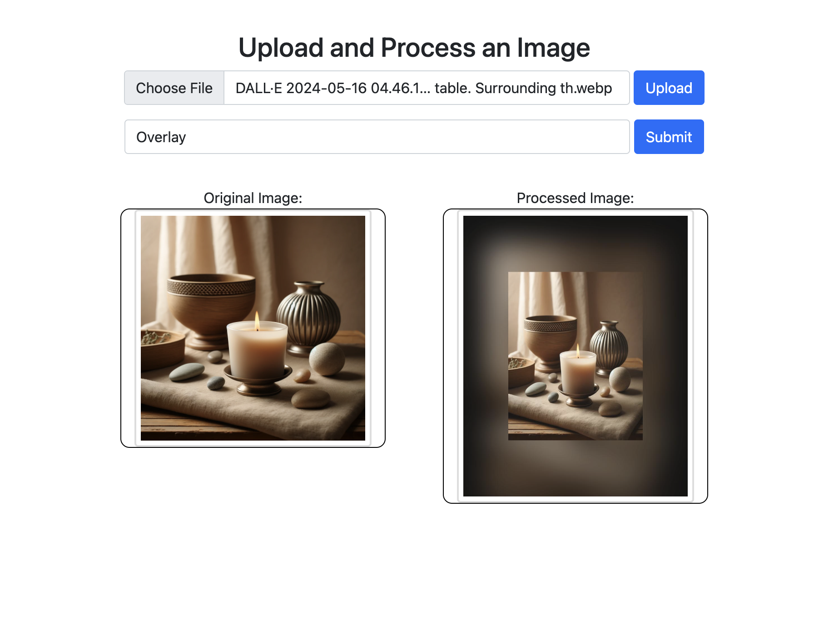
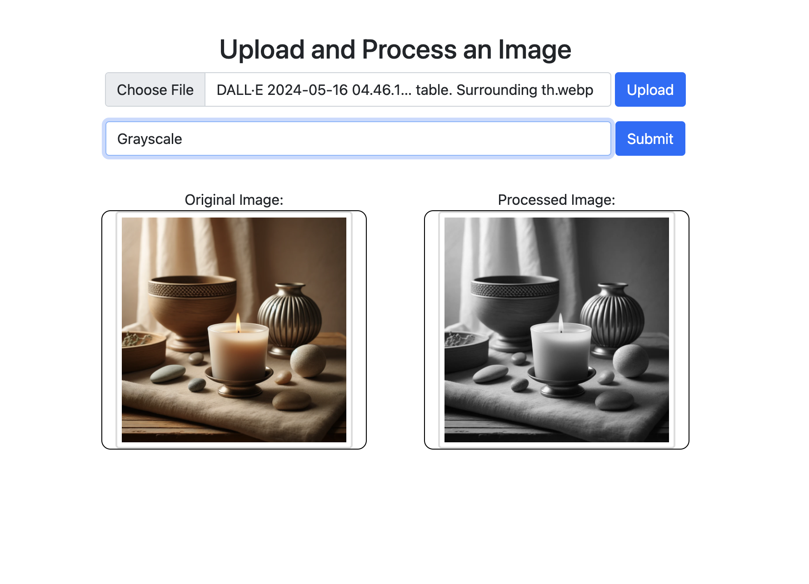

# Description
This web application provides a simple interface for uploading and processing images. It is built using FastAPI and utilizes the PIL library for image manipulation.

# Features
- Grayscale Conversion: Converts a color image to grayscale.
- Overlay Effects: Applies special overlay effects to images.

# Installation

1. Clone the repository:
```
git clone https://github.com/Topaz1618/SwiftPic.git
cd SwiftPic
```

2. Install dependencies:
```
pip install -r requirements.txt
```

3. Start the server:
```
uvicorn apps:app --reload
```

# Usage
After starting the server, go to http://127.0.0.1:8000/ in your browser to access the application.

# Example


